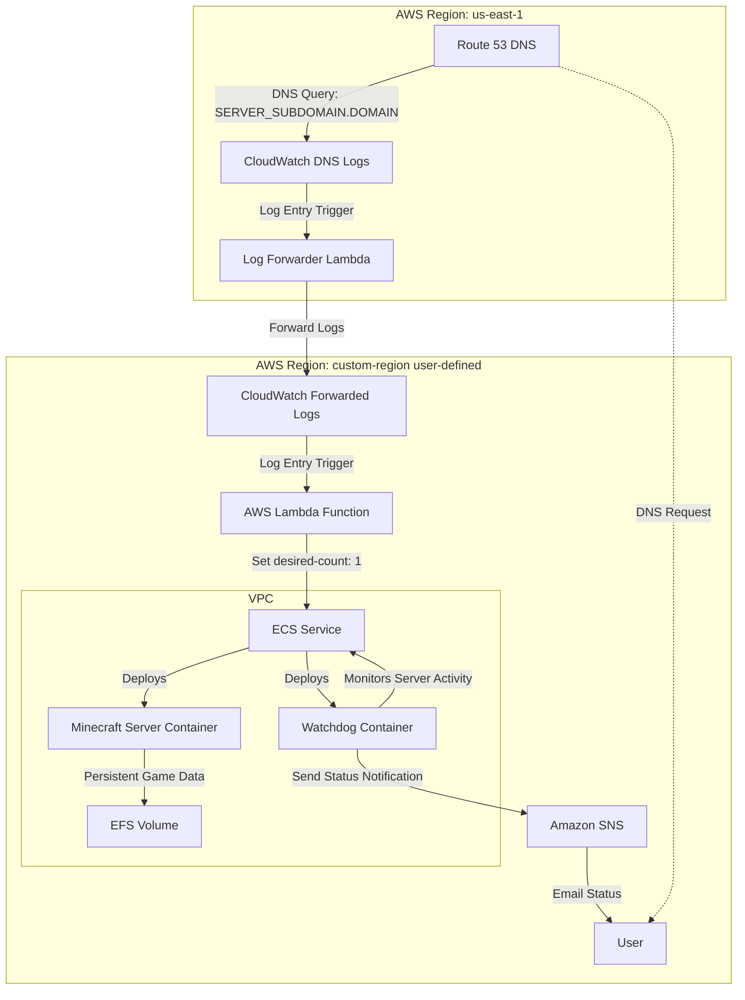

# cdk-on-demand-minecraft-server

`cdk-on-demand-minecraft-server` is an AWS CDK App that sets up an on-demand Minecraft server using AWS. The server automatically starts when players connect and stops when idle, helping reduce costs by running only when needed.

## Motivation

This project set up a quick, low-cost way to play Minecraft with friends without needing a 24/7 server. The idea was to spin up the server only when needed and save on costs by shutting it down when idle. Along the way, it was a chance to learn about using ECS for container management and EFS for persistent storage. 😊

## Environment Variables

### Required:
- **ECS_MINECRAFT_EDITION**: `java` or `bedrock` - Specify the Minecraft edition.
- **ROUTE53_SERVER_SUBDOMAIN**: Subdomain for the server (e.g., "minecraft").
- **ROUTE53_DOMAIN**: Domain for the server (e.g., "example.com").
- **ROUTE53_HOSTED_ZONE_ID**: Hosted Zone ID in Route 53.
- **SNS_EMAIL**: Email address for SNS notifications.
- **AWS_DESTINATION_ACCOUNT**: AWS Account ID for resource deployment.
- **AWS_DESTINATION_REGION**: AWS Region for resource deployment.

### Optional (Defaults in parentheses):
- **ECS_MEMORY_SIZE**: Memory for ECS task (`8192`).
- **ECS_CPU_SIZE**: CPU for ECS task (`4096`).
- **ECS_STARTUP_MIN**: Startup wait time in minutes (`10`).
- **ECS_SHUTDOWN_MIN**: Shutdown wait time in minutes (`20`).
- **ECS_DEBUG**: Enable debug mode (`false`).
- **ECS_ENABLE_PERSISTENCE**: Enable EFS persistence (`true`).

### Minecraft Server Config:
- **MINECRAFT_VERSION**: Server version (`LATEST`)
- **MINECRAFT_MOTD**: Message of the Day (`Welcome to the server`)
- **MINECRAFT_DIFFICULTY**: Difficulty level (`easy`)
- **MINECRAFT_MAX_PLAYERS**: Maximum players (`20`)
- **MINECRAFT_ALLOW_NETHER**: Allow Nether dimension (`true`)
- **MINECRAFT_ANNOUNCE_PLAYER_ACHIEVEMENTS**: Announce achievements (`true`)
- **MINECRAFT_GENERATE_STRUCTURES**: Generate structures (`true`)
- **MINECRAFT_HARDCORE**: Hardcore mode (`false`)
- **MINECRAFT_SNOOPER_ENABLED**: Enable snooping (`true`)
- **MINECRAFT_MAX_BUILD_HEIGHT**: Maximum build height (`256`)
- **MINECRAFT_SPAWN_ANIMALS**: Spawn animals (`true`)
- **MINECRAFT_SPAWN_MONSTERS**: Spawn monsters (`true`)
- **MINECRAFT_SPAWN_NPCS**: Spawn NPCs (`true`)
- **MINECRAFT_SEED**: Custom world seed (default: empty)
- **MINECRAFT_MODE**: Game mode (`survival`)
- **MINECRAFT_PVP**: Enable PvP (`true`)
- **MINECRAFT_ONLINE_MODE**: Online mode (`true`)
- **MINECRAFT_SERVER_NAME**: Server name (default: empty)
- **MINECRAFT_ENABLE_WHITELIST**: Enable whitelist (`false`)
- **MINECRAFT_WHITELIST**: Comma-separated usernames/UUIDs for whitelist (default: empty)
- **MINECRAFT_OP_PERMISSION_LEVEL**: OP level (`1`)

### AWS Configuration:
- **AWS_STACK_NAME**: Name of the CDK stack (`MinecraftServerStack`)

### Tips:
- **Rename `.env_example` to `.env`** and configure before deployment.
- Ensure all **required** variables are set, especially DNS and SNS.

## Deployment

Requires `Go` (1.23+) + `cdk` (2.16+). You'll also need an AWS Account. Furthermore a Route 53 domain and a  Hosted Zone ID is required for this deployment to work.

1. **Clone the Repository**
   ```
   git clone https://github.com/cbrgm/cdk-on-demand-minecraft-server.git
   cd cdk-on-demand-minecraft-server
   ```

2. **Configure Environment Variables**
   - Rename `.env_example` to `.env`:
     ```
     mv .env_example .env
     ```
   - Adjust `.env` to set the required and optional environment variables.

3. **Deploy the CDK Stack**
   ```
   make sync
   make cdk-deploy
   ```

## How It Works (Updated)



- **Route 53 (Global)**: DNS service. When users access the Minecraft server via `SERVER_SUBDOMAIN.DOMAIN`, Route 53 directs the DNS query, initiating the process.
- **CloudWatch Logs (us-east-1)**: Captures DNS logs from Route 53.
- **Log Forwarder Lambda (us-east-1)**: Forwards DNS logs from the `us-east-1` log group to a log group in a user-defined region.
- **CloudWatch Logs (custom-region)**: Receives forwarded DNS logs, triggering further events.
- **AWS Lambda (custom-region)**: Analyzes log data and sets the `desired-count` of the ECS Service to 1, starting the Minecraft server and watchdog containers.
- **ECS Service (custom-region)**: Manages deployment of Minecraft server and watchdog containers, running them on-demand and stopping to save costs.
- **Minecraft Server Container (custom-region)**: Hosts the actual Minecraft game server, using EFS for persistent game data.
- **Watchdog Container (custom-region)**: Monitors Minecraft server activity, stopping the server if no players are active for a set period.
- **EFS (Elastic File System, custom-region)**: Provides persistent storage for game data, ensuring it’s preserved even when the server stops.
- **SNS (custom-region)**: Sends alerts to users when the server starts or stops.

## Back of the Envelope Cost Calculation (Under $10/Month)

**Disclaimer**: The pricing heavily depends on usage patterns. There are certainly cheaper options for running a Minecraft server, but this setup is serverless, offering flexibility and scalability, which comes at a cost.

### Assumptions:
- **ECS Fargate**: 4 vCPUs, 8 GB RAM, 24 hours/month
- **AWS Lambda**: Minimal usage, within Free Tier (10,000 invocations)
- **CloudWatch**: 1 GB logs/month, within Free Tier
- **EFS**: 10 GB storage
- **Route 53**: 1 hosted zone, 10,000 queries/month
- **SNS**: Minimal usage, within Free Tier

### Cost Breakdown (as of 2024):

| Component       | Pricing Details                                  | Calculation                                              | Estimate (USD) |
|----------------- |--------------------------------------------------|----------------------------------------------------------|----------------|
| **ECS Fargate**  | $0.04048/vCPU-hour, $0.004445/GB-hour            | vCPU: 4 × $0.04048 = $0.16192/hour                       |                |
|                 |                                                  | RAM: 8 × $0.004445 = $0.03556/hour                       |                |
|                 |                                                  | Total per hour: $0.19748                                |                |
|                 |                                                  | Monthly (24 hours): 24 × $0.19748                       | **$4.74**      |
| **AWS Lambda**  | Free Tier covers 10,000 invocations              | No additional cost                                       | **$0.00**      |
| **CloudWatch**  | Free Tier (5 GB logs/month)                      | No additional cost                                       | **$0.00**      |
| **EFS**         | $0.30/GB-month                                   | 10 GB × $0.30                                            | **$3.00**      |
| **Route 53**    | $0.50/hosted zone, $0.40/million queries         | 1 hosted zone: $0.50                                     |                |
|                 |                                                  | Queries: 10,000 ≈ $0.01                                  |                |
|                 |                                                  | Total: $0.50 + $0.01                                     | **$0.51**      |
| **SNS**         | Free Tier (1,000 notifications)                  | No additional cost                                       | **$0.00**      |
| **Total**       |                                                  |                                                          | **$8.25**      |

My development time invested in this project comes for free 😊

## FAQ / Learnings

### DNS query logging only works in `us-east-1`?
- Yes, for Route 53 DNS query logging, the CloudWatch log group must be in `us-east-1`. Whoever decided that...

### Vendor logs can’t be forwarded across regions?
- Correct. Route 53 and similar logs can't be forwarded directly to log groups in other regions.
- Use a Firehose stream or Lambda to move logs between regions. I'm using a lambda function here.

### CDK stacks can’t deploy to multiple regions?
- No. Deploying resources to different regions requires splitting into separate stacks.

### CloudWatch logs are gzipped?
- Yes, they are. You can't just forward events directly; you need to handle decompression first.

## Acknowledgements

Special Thanks to the following projects:

* [VeriorPies/MineCloud](https://github.com/VeriorPies/MineCloud)
* [itzg/docker-minecraft-server](https://github.com/itzg/docker-minecraft-server)

## Contributing & License

We welcome and value your contributions to this project! 👍 If you're interested in making improvements or adding features, please refer to our [Contributing Guide](https://github.com/cbrgm/cdk-on-demand-minecraft-server/blob/main/CONTRIBUTING.md). This guide provides comprehensive instructions on how to submit changes, set up your development environment, and more.

Please note that this project is developed in my spare time and is available for free 🕒💻. As an open-source initiative, it is governed by the [Apache 2.0 License](https://github.com/cbrgm/cdk-on-demand-minecraft-server/blob/main/LICENSE). This license outlines your rights and obligations when using, modifying, and distributing this software.

Your involvement, whether it's through code contributions, suggestions, or feedback, is crucial for the ongoing improvement and success of this project. Together, we can ensure it remains a useful and well-maintained resource for everyone 🌍.
